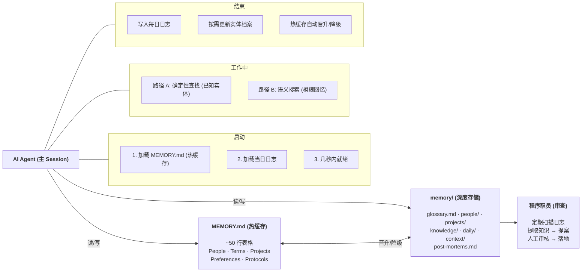

# OpenClaw Memory Architecture

一套经过实战验证的 AI Agent 记忆系统。解决 Agent 跨 session 失忆的问题。


---

## 这个项目是什么

AI Agent 每次启动都是一张白纸——不记得昨天做了什么决策、上周踩了什么坑、用户有什么偏好。这是所有长期运行 Agent 的核心痛点。

这个项目提供了一套完整的解决方案：**双层文件架构 + 分层查找协议 + 知识自动沉淀流程**。存储层是纯 Markdown + JSON（Git 友好，人类可读），检索层结合确定性查找和 embedding 语义搜索。经过数月日常使用打磨。

```
MEMORY.md (热缓存, ~50 行)     <- 覆盖 90% 日常解码
memory/ (深度存储, 无限扩展)    <- 覆盖剩余 10% + 完整历史
```

## 架构总览


<details>
    <summary>主要流程</summary>


</details>

---

## 核心设计

### 1. 双层架构

热缓存（MEMORY.md）负责快速解码——Agent 醒来后几秒内就能理解"我是谁、用户是谁、在做什么"。深度存储（memory/）负责一切细节：人物档案、项目状态、技术知识、经验教训、每日事件流。

双层之间有自动晋升/降级机制：一周内使用 3 次以上的条目晋升到热缓存，30 天未使用的条目降级到深度存储。热缓存始终保持精简。

### 2. 分层查找协议

两条路径按场景选择：

- 路径 A（确定性查找）：已知实体解码，从热缓存到术语表到档案目录，逐层查找，快且确定。不依赖任何外部服务。
- 路径 B（语义搜索）：基于 embedding 的模糊回忆，"之前讨论过 X 吗"类问题，跨文件关联。措辞不同也能找到。

简单查询走路径 A，复杂问题两条都走。确定性优先，语义搜索兜底。路径 A 覆盖 90% 的日常场景且零外部依赖，路径 B 处理剩余 10% 的模糊查询。即使 embedding 服务暂时不可用，系统仍然能正常工作。

### 3. Supersede 机制

事实会变。项目从"进行中"变成"已完成"，人员换了角色，配置更新了。直接覆盖旧值会丢失历史。

每个实体（人物、项目）用 JSON 原子事实链追踪。新事实与旧事实矛盾时，旧事实标记为 `superseded` 并指向新事实。不删除任何记录，完整历史链可追溯。

```json
{
  "id": "alice-002",
  "fact": "Working on Project Alpha",
  "status": "superseded",
  "supersededBy": "alice-004"
}
```

这是用平面文件实现的事实演变追踪——在小规模场景下，效果与时序知识图谱相当，复杂度低一个数量级。

### 4. 程序职员模式

灵感来自 Brooks《人月神话》中的程序职员角色。

主 Agent 在执行任务时不做任何"这个要不要记下来"的元认知判断——只负责把每日日志写清楚。一个独立的审查进程（程序职员）定期扫描日志，自动识别设计决策、可复用经验、新术语、实体变更、重复模式，生成结构化提案。人工审核通过后才写入记忆。

跟 Mem0 自动提取的区别：Mem0 是全自动的（提取了什么不一定知道），程序职员模式是半自动的（自动发现，人工审核）。在记忆这种核心资产上，质量优先于便利。

### 5. 执行透明

所有自动化任务必须产出可见报告。不允许静默执行。

每个定时任务写结构化执行日志（元信息、执行步骤、关键决策、结果摘要），即时推送到 Git 仓库，报告末尾附可点击的日志链接。配合 token 追踪脚本和自动更新的仪表盘，实现完整的执行可追溯性。

---

## 与其他记忆方案的对比

### 在 OpenClaw 生态内的定位

OpenClaw 默认提供了文件驱动的记忆基础设施：`MEMORY.md`（长期记忆）+ `memory/YYYY-MM-DD.md`（每日日志）+ `memory_search`/`memory_get` 工具（embedding 语义搜索）。这是一个优秀的起点，但它只提供了存储和检索的原语——如何组织记忆、如何查找信息、如何追踪事实变化、如何沉淀知识，这些上层问题留给了用户自己解决。

本项目是在 OpenClaw 记忆基础设施之上构建的**上层架构**，解决的是"有了工具之后怎么用好"的问题。

| 维度 | OpenClaw 默认 | 本项目 |
|------|-------------|--------|
| 存储结构 | MEMORY.md + daily log，无进一步规范 | 按类型分目录（people/projects/knowledge/context），每类有明确 schema |
| 检索方式 | memory_search（embedding）+ memory_get（精确读取） | 分层查找协议：路径 A 确定性查找（热缓存→术语表→档案）+ 路径 B 语义搜索，明确的场景路由规则 |
| 事实追踪 | 无（覆盖即丢失） | Supersede 机制：JSON 原子事实链，旧事实标记替代而非删除 |
| 知识沉淀 | 依赖 Agent 自觉写入 | 程序职员模式：独立审查进程扫描日志，自动提案，人工审核后落地 |
| 热缓存管理 | MEMORY.md 无大小约束，容易膨胀 | 晋升/降级规则：高频条目晋升热缓存，低频条目降级深度存储，热缓存始终 ~50 行 |
| 降级能力 | embedding 不可用时 memory_search 失效 | 路径 A 完全不依赖 embedding，覆盖 90% 日常场景 |

### 与社区常见方案的对比

OpenClaw 社区中，记忆方案大致分为三类：

**方案一：单文件增强**

最常见的做法——把所有重要信息塞进 MEMORY.md，不断追加。简单直接，但随着时间推移，文件膨胀、信息密度下降、查找效率降低。Claude Code 社区也有类似问题（CLAUDE.md 膨胀导致一个 "hi" 消息消耗 53K tokens）。

本项目的双层分离 + 晋升/降级机制在一定程度上缓解了这个问题：热缓存始终精简，深度存储按类型组织。

**方案二：外部记忆平台集成（如 Mem0 for OpenClaw）**

Mem0 等平台提供了 OpenClaw 集成，用向量数据库 + 知识图谱替代文件存储。优势是自动提取和语义检索能力强，但引入了外部依赖、黑盒提取（不知道提取了什么、遗漏了什么）、数据锁定在平台内。

本项目选择了不同的路线：存储层保持纯文件（透明、可控、Git 友好），检索层复用 OpenClaw 内置的 embedding 能力。存储和检索解耦，即使 embedding 服务不可用，确定性查找仍然完全可用。

**方案三：纯日志流（只写 daily log，不做整理）**

有些用户只依赖每日日志 + memory_search 的语义搜索。好处是零维护成本，但随着日志积累，搜索结果噪音增大，缺乏结构化的知识沉淀，同一个事实可能散落在几十个日志文件中。

本项目通过"日志到知识"进行转化：独立进程定期扫描日志，识别设计决策、可复用经验、实体变更，生成结构化提案，人工审核后写入对应的知识文件。

### 更广泛的记忆方案光谱

跳出 OpenClaw 生态，当前 AI Agent 记忆方案：


| 维度 | CLAUDE.md | Mem0 | Zep | Letta | 本项目 |
|------|-----------|------|-----|-------|--------|
| 存储层 | 单文件 | 向量数据库 | 图数据库 | 自管理存储 | 纯文件（Markdown + JSON） |
| 检索层 | 全文扫描 | embedding + rerank | 图查询 + BM25 | Agent 自主 | 确定性查找 + embedding 语义搜索 |
| 基础设施 | 无 | 向量 DB + embedding API | 图 DB | Letta 服务 | embedding API（可选，路径 A 不依赖） |
| 事实演变追踪 | 无 | 有限 | 时序图谱 | 有限 | Supersede 链（JSON 平面文件） |
| 知识沉淀 | 手动 | 自动提取（黑盒） | 自动提取 | Agent 自主 | 程序职员（自动提案 + 人工审核） |
| 透明度 | 高（但不可管理） | 低（黑盒提取） | 中 | 中 | 高（所有文件可读可编辑） |
| 数据主权 | 高 | 低（平台锁定） | 中 | 中 | 高（本地文件 + Git） |
| 降级能力 | 无 | 无 | 无 | 有限 | 有（embedding 不可用时路径 A 仍工作） |
| 适用规模 | 小 | 中-大 | 中-大 | 中-大 | 小-中（<500 实体最佳） |

### 适用场景

本项目不试图替代 Mem0 或 Zep。如果场景是数千用户、海量交互历史、复杂关系推理——应该用专业的记忆平台。

本项目主要解决的场景：**一个人（或一个小团队）和一个长期运行的 AI Agent 协作**。在这个场景下：

- 实体数量有限（几十到几百，不是几千）
- 透明度和可控性比自动化更重要
- 数据主权是硬需求
- 低运维成本是现实约束
- 知识沉淀需要人在回路
- 需要降级能力（embedding 服务不可用时，确定性查找仍然能工作）

---

## 目录结构

```
.
├── README.md                          <- 本文件
├── docs/
│   ├── 00-getting-started.md          <- 上手指南（从这里开始）
│   ├── 01-core-architecture.md        <- 双层架构设计与理由
│   ├── 02-memory-layout.md            <- 文件结构与 schema
│   ├── 03-lookup-protocol.md          <- 分层查找协议
│   ├── 04-entity-tracking.md          <- Supersede 机制详解
│   ├── 05-knowledge-pipeline.md       <- 程序职员模式
│   ├── 06-cron-automation.md          <- 定时任务与投递最佳实践
│   ├── 07-execution-transparency.md   <- 执行日志与仪表盘
│   ├── 08-backup-system.md            <- Git 备份体系
│   ├── 09-task-management.md          <- 任务管理集成
│   ├── 10-post-mortems.md             <- 从失败中学习
│   └── 11-data-flow.md               <- 数据流全景
├── templates/                         <- 可直接使用的模板
│   ├── MEMORY.md, AGENTS.md, SOUL.md, USER.md
│   ├── items.json                     <- 实体事实追踪 schema
│   ├── daily-log.md, knowledge-file.md, post-mortems.md
│   └── cron-prompt.md                 <- 定时任务 prompt 模板
├── scripts/                           <- 辅助脚本（脱敏版）
│   ├── token-tracker.js               <- Token 用量追踪（零 LLM 开销）
│   └── auto-backup.sh                 <- Git 全量备份
└── examples/                          <- 完整示例（脱敏数据）
    ├── MEMORY.md                      <- 填充好的热缓存示例
    └── memory/                        <- 完整目录结构示例
```

## 快速开始

详见 [docs/00-getting-started.md](docs/00-getting-started.md)。简要步骤：

1. 复制 `templates/` 到你的工作区，将核心文件（MEMORY.md、AGENTS.md、SOUL.md、USER.md）移到根目录
2. 创建 `memory/` 目录结构：`daily/`、`people/`、`projects/`、`knowledge/`、`context/`
3. 自定义各模板文件，参考 `examples/` 中的完整示例
4. 将 AGENTS.md 中的查找协议加入 Agent 的 system prompt
5. 可选：配置备份脚本和 token 追踪（需先编辑路径和 job ID）

## 设计哲学

- 积淀大于新鲜感。各功能单独都有替代品，但集中沉淀才是质变。
- 透明可追溯。不信任黑盒，所有自动化必须有输出报告。
- 数据主权。本地文件，Git 备份，不锁定平台。
- 深度大于广度。一篇深度分析胜过十条浅层摘要。
- 确定性优先。可预测的行为比灵活的自主性更适合生产环境。

## 项目背景与设计溯源

这套系统在 [OpenClaw](https://github.com/openclaw/openclaw) 上经过数月日常使用演化而来，每个核心设计都有明确的灵感来源和真实的踩坑故事。

### 养分来源

**Anthropic `knowledge-work-plugins`** — 架构起点。该项目的 `memory-management` skill 提出了两层记忆 + 分层查找链 + 晋升/降级的核心思想。当时的判断是"代码价值不高（全 Markdown），设计思想价值极高"。本项目的双层架构、分层查找协议、晋升/降级规则直接源于此。

**saramiwa 三层记忆系统**（BotLearn 社区）— Supersede 机制的直接来源。saramiwa 的帖子《How I Built a Three-Layer Memory System That Actually Remembers》提出了 JSON 原子事实追踪 + supersede 链 + 实体摘要自动重写的模式。评估后引入了 Supersede 机制和目录结构（summary.md + items.json），但判断 qmd 混合检索（BM25+向量+reranking）和微同步（每 30min 廉价模型扫描对话提取事实）在当前规模下 ROI 不高，列为未来候选。

**Felix "Project Accountability"**（BotLearn 社区）— 子 Agent 协作模式的来源。Felix 提出的 Chain of Custody（监管链）和 Context Slicing（精确上下文切片）模式，直接影响了本项目中 Dispatcher 协议和子 Agent 验收清单的设计。同时参考了 Skywork Mission Control 的并发实测数据（并发 >4 时错误率从 1.8% 升至 4.6%）。

**Brooks《人月神话》** — 程序职员模式的概念原型。外科手术队伍中"程序职员"负责记录和整理所有文档，主程序员专注编码。该角色分离的思想被应用到知识沉淀流程：主 Agent 专注任务执行，独立审查进程负责从日志中发现和提炼知识。

### 评估过但未引入的方案

| 方案 | 来源 | 判断 | 什么时候需要 |
|------|------|------|---------|
| qmd 混合检索（BM25+向量+reranking） | saramiwa / tobi/qmd / openclaw-engram | Hold | 文件量 >500 或 search-miss >=3 次 |
| 微同步（每 30min 廉价模型扫描对话提取事实） | saramiwa 三层记忆 | Hold | 重要信息被 compaction 吞掉 >=2 次 |
| Capability Evolver（自动能力进化） | OpenClaw 社区 skill | Hold（与程序职员模式类似） | — |
| GitHub Issues 作为 Agent 状态机 | Felix / BotLearn | Hold | 任务规模达到 15-20 个 |

虽然本记忆架构是在 OpenClaw 上开发和验证，但架构和流程本身是平台无关的，可以适配任何支持文件读写的 Agent 平台。

